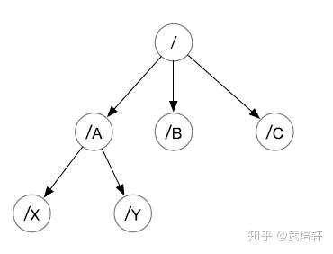
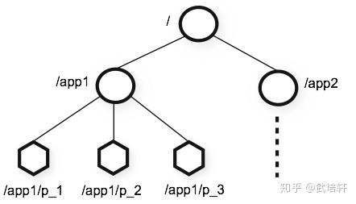
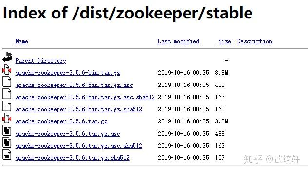

## 什么是 [ZooKeeper](https://zhida.zhihu.com/search?content_id=110098168&content_type=Article&match_order=1&q=ZooKeeper&zhida_source=entity)？

ZooKeeper 是一个分布式的，开放源码的分布式应用程序协同服务。ZooKeeper 的设计目标是将那些复杂且容易出错的分布式一致性服务封装起来，构成一个高效可靠的原语集，并以一系列简单易用的接口提供给用户使用。

## ZooKeeper 发展历史

ZooKeeper 最早起源于雅虎研究院的一个研究小组。在当时，研究人员发现，在雅虎内部很多大型系统基本都需要依赖一个类似的系统来进行分布式协同，但是这些系统往往都存在分布式单点问题。

所以，雅虎的开发人员就开发了一个通用的无单点问题的分布式协调框架，这就是 ZooKeeper。ZooKeeper 之后在开源界被大量使用，下面列出了 3 个著名开源项目是如何使用 ZooKeeper：

- [Hadoop](https://zhida.zhihu.com/search?content_id=110098168&content_type=Article&match_order=1&q=Hadoop&zhida_source=entity)：使用 ZooKeeper 做 [Namenode](https://zhida.zhihu.com/search?content_id=110098168&content_type=Article&match_order=1&q=Namenode&zhida_source=entity) 的高可用。
- [HBase](https://zhida.zhihu.com/search?content_id=110098168&content_type=Article&match_order=1&q=HBase&zhida_source=entity)：保证集群中只有一个 master，保存 hbase:meta 表的位置，保存集群中的 [RegionServer](https://zhida.zhihu.com/search?content_id=110098168&content_type=Article&match_order=1&q=RegionServer&zhida_source=entity) 列表。
- [Kafka](https://zhida.zhihu.com/search?content_id=110098168&content_type=Article&match_order=1&q=Kafka&zhida_source=entity)：集群成员管理，controller 节点选举。

## ZooKeeper 应用场景

很多分布式协调服务都可以用 ZooKeeper 来做，其中典型应用场景如下：

- 配置管理（configuration management）：如果我们做普通的 Java 应用，一般配置项就是一个本地的配置文件，如果是微服务系统，各个独立服务都要使用集中化的配置管理，这个时候就需要 ZooKeeper。
- DNS 服务
- 组成员管理（group membership）：比如上面讲到的 HBase 其实就是用来做集群的组成员管理。
- 各种分布式锁

ZooKeeper 适用于存储和协同相关的关键数据，不适合用于大数据量存储。如果要存 KV 或者大量的业务数据，还是要用数据库或者其他 NoSql 来做。

为什么 ZooKeeper 不适合大数据量存储呢？主要有以下两个原因：

1. 设计方面：ZooKeeper 需要把所有的数据（它的 data tree）加载到内存中。这就决定了ZooKeeper 存储的数据量受内存的限制。这一点 ZooKeeper 和 Redis 比较像。一般的数据库系统例如 MySQL（使用 [InnoDB](https://zhida.zhihu.com/search?content_id=110098168&content_type=Article&match_order=1&q=InnoDB&zhida_source=entity) 存储引擎的话）可以存储大于内存的数据，这是因为 InnoDB 是基于 [B-Tree](https://zhida.zhihu.com/search?content_id=110098168&content_type=Article&match_order=1&q=B-Tree&zhida_source=entity) 的存储引擎。B-tree 存储引擎和 [LSM 存储引擎](https://zhida.zhihu.com/search?content_id=110098168&content_type=Article&match_order=1&q=LSM+存储引擎&zhida_source=entity)都可以存储大于内存的数据量。
2. 工程方面：ZooKeeper 的设计目标是为协同服务提供数据存储，数据的高可用性和性能是最重要的系统指标，处理大数量不是 ZooKeeper 的首要目标。因此，ZooKeeper 不会对大数量存储做太多工程上的优化。

## ZooKeeper 服务的使用

要使用 ZooKeeper 服务，首先我们的应用要引入 ZooKeeper 的客户端库，然后我们客户端库和 ZooKeeper 集群来进行网络通信来使用 ZooKeeper 的服务，本质上是 Client-Server 的架构，我们的应用作为一个客户端来调用 ZooKeeper Server 端的服务。


## ZooKeeper 数据模型





ZooKeeper 的数据模型是层次模型。层次模型常见于文件系统。层次模型和 key-value 模型是两种主流的数据模型。ZooKeeper 使用文件系统模型主要基于以下两点考虑：

1. 文件系统的树形结构便于表达数据之间的层次关系。
2. 文件系统的树形结构便于为不同的应用分配独立的命名空间（namespace）。

ZooKeeper 的层次模型称作 data tree。Data tree 的每个节点叫做 [znode](https://zhida.zhihu.com/search?content_id=110098168&content_type=Article&match_order=1&q=znode&zhida_source=entity)。不同于文件系统，每个节点都可以保存数据。每个节点都有一个版本(version)，版本从 0 开始计数。





如上图所示的 data tree 中有两个子树，一个用于应用 1（/app1）和另一个用于应用 2（/app2）。

应用 1 的子树实现了一个简单的组成员协议：每个客户端进程 pi 创建一个 znode p_i 在 /app1 下，只要 /app1/p_i 存在就代表进程 pi 在正常运行。

## data tree 接口

ZooKeeper 对外提供一个用来访问 data tree的简化文件系统 API：

- 使用 UNIX 风格的路径名来定位 znode,例如 /A/X 表示 znode A 的子节点 X。
- znode 的数据只支持全量写入和读取，没有像通用文件系统那样支持部分写入和读取。
- data tree 的所有 API 都是 wait-free 的，正在执行中的 API 调用不会影响其他 API 的完成。
- data tree 的 API都是对文件系统的 wait-free 操作，不直接提供锁这样的分布式协同机制。但是 data tree 的 API 非常强大，可以用来实现多种分布式协同机制。

## znode 分类

一个 znode 可以是持久性的，也可以是临时性的，znode 节点也可以是顺序性的。每一个顺序性的 znode 关联一个唯一的单调递增整数，因此 ZooKeeper 主要有以下 4 种 znode：

1. 持久性的 znode (PERSISTENT): ZooKeeper 宕机，或者 client 宕机，这个 znode 一旦创建就不会丢失。
2. 临时性的 znode (EPHEMERAL): ZooKeeper 宕机了，或者 client 在指定的 timeout 时间内没有连接 server，都会被认为丢失。
3. 持久顺序性的 znode (PERSISTENT_SEQUENTIAL): znode 除了具备持久性 znode 的特点之外，znode 的名字具备顺序性。
4. 临时顺序性的 znode (EPHEMERAL_SEQUENTIAL): znode 除了具备临时性 znode 的特点之外，znode 的名字具备顺序性。

## 安装 ZooKeeper

到 [https://archive.apache.org/dist/zookeeper/stable/](https://link.zhihu.com/?target=https%3A//archive.apache.org/dist/zookeeper/stable/) 下载 ZooKeeper，目前的最新版是 3.5.6。





把 apache-zookeeper-3.5.6-bin.tar.gz 解压到一个本地目录 (目录名最好不要包含空格和中文)。我使用 /usr/local 目录。

```text
tar -zxvf apache-zookeeper-3.5.6-bin.tar.gz
```

把 conf 目录下的 zoo_sample.cfg 重命名为 zoo.cfg，然后修改配置。

```text
# 心跳检查的时间 2秒
tickTime=2000
# 初始化时 连接到服务器端的间隔次数，总时间10*2=20秒
initLimit=10
# ZK Leader 和follower 之间通讯的次数，总时间5*2=10秒
syncLimit=5
# 存储内存中数据快照的位置，如果不设置参数，更新事务日志将被存储到默认位置。
dataDir=/data/zookeeper
# ZK 服务器端的监听端口  
clientPort=2181
```

配置以下环境变量 `vim /etc/profile` ：

```text
export ZOOKEEPER_HOME=/usr/local/apache-zookeeper-3.5.6-bin
export PATH=$PATH:$ZOOKEEPER_HOME/bin:$ZOOKEEPER_HOME/conf
```

## 启动 Zookeeper

再安装配置完成后，就可以启动 Zookeeper，使用 zkServer.sh start 启动 ZooKeeper 服务：

```text
[root@wupx apache-zookeeper-3.5.6-bin]# zkServer.sh start
/usr/bin/java
ZooKeeper JMX enabled by default
Using config: /usr/local/apache-zookeeper-3.5.6-bin/bin/../conf/zoo.cfg
Starting zookeeper ... STARTED
```

检查 ZooKeeper 日志是否有出错信息：

```text
[root@wupx apache-zookeeper-3.5.6-bin]# cd logs/
[root@wupx logs]# grep -E -i "((exception)|(error))" *
```

因为返回没有结果，说明没有错误信息。

检查 ZooKeeper 数据文件，这里存放的 ZooKeeper 的事务日志文件和快照日志文件。

```text
[root@wupx zookeeper]# cd /data/zookeeper/
[root@wupx zookeeper]# tree
.
├── version-2
│   └── snapshot.0
└── zookeeper_server.pid
1 directory, 2 files
```

因为现在还没有运行任何 ZooKeeper 命令，所以还没有事务日志文件。

最后会检查 ZooKeeper 是否在 2181 端口上监听。

```
netstat -an | ag 2181
```

执行后，我们可以看到 ZooKeeper 已经在 2181 这个端口上监听了。

下面我们演示下如何使用 zkCli：

## zkCli 使用

在执行 `zkCli.sh` 命令后，会出现很多消息，这些消息证明我们的 zkCli 和 ZooKeeper 的节点建立了有效连接。

```text
2019-12-22 10:38:36,684 [myid:localhost:2181] - INFO  [main-SendThread(localhost:2181):ClientCnxn$SendThread@959] - Socket connection established, initiating session, client: /127.0.0.1:54038, server: localhost/127.0.0.1:2181
```

使用 `ls -R /` 可以递归查找 ZooKeeper 的 znode 节点，使用 `create /znode_name` 可以创建 znode 节点，具体演示如下：

```text
# 使用 ls -R 可以递归查找 ZooKeeper 的 znode 节点
[zk: localhost:2181(CONNECTED) 0] ls -R /
/
/zookeeper
/zookeeper/config
/zookeeper/quota
# 创建 znode /app1
[zk: localhost:2181(CONNECTED) 1] create /app1
Created /app1
[zk: localhost:2181(CONNECTED) 2] create /app2
Created /app2
[zk: localhost:2181(CONNECTED) 3] create /app1/p_1 1
Created /app1/p_1
[zk: localhost:2181(CONNECTED) 4] create /app1/p_2 2
Created /app1/p_2
[zk: localhost:2181(CONNECTED) 5] create /app1/p_3 3
Created /app1/p_3
[zk: localhost:2181(CONNECTED) 6] ls -R /
/
/app1
/app2
/zookeeper
/app1/p_1
/app1/p_2
/app1/p_3
/zookeeper/config
/zookeeper/quota
```

## 用 zkCli 实现锁

分布式锁要求如果锁的持有者宕了，锁可以被释放。ZooKeeper 的 ephemeral 节点恰好具备这样的特性。

接下来我们来演示下，需要在两个终端上分别启动 zkCli，

在终端 1 上：

执行 `zkCli.sh`，再执行 `create -e /lock` 命令，来建立临时 znode，加锁的操作其实就是建立 znode 的过程，此时第一个客户端加锁成功。

接下来尝试在第二个客户端加锁，在终端 2 上：

执行 `zkCli.sh`，再执行 `create -e /lock` 命令，会发现提示 `Node already exists: /lock`，提示 znode 已存在，znode 建立失败，因此加锁失败，这时候我们来监控这个 znode，使用 `stat -w /lock` 来等待锁被释放。

这个时候我们退出第一个客户端，在终端 1 上执行 `quit` 命令，会在客户端 2 上收到一条 WATCHER 信息，具体如下：

```text
WATCHER::
WatchedEvent state:SyncConnected type:NodeDeleted path:/lock
```

再收到这个事件后再次在客户端 2 上执行加锁，执行 `create -e /lock`，会显示创建 znode 成功，即加锁成功。

## 总结

这篇文章主要介绍了 ZooKeeper 的安装配置，ZooKeeper 的基本概念和 zkCli 的使用，并用 zkCli 来实现一个锁，为后面更加深入的学习打好基础。