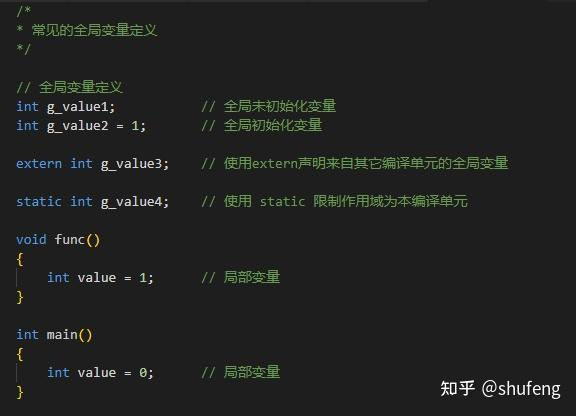

### `c++`[全局变量](https://zhida.zhihu.com/search?content_id=241415151&content_type=Article&match_order=1&q=全局变量&zhida_source=entity)是什么？

这里的全局指的是**整个程序的全局**。`c++`程序由若干个[cpp文件](https://zhida.zhihu.com/search?content_id=241415151&content_type=Article&match_order=1&q=cpp文件&zhida_source=entity)编译而成，在某个cpp文件定义的全局变量，会被所有cpp文件可见，因为全局变量默认外部链接。

在任何局部作用域之外的定义的变量，一般在某个文件中的局部作用域外定义，例如在函数外部定义的变量。

### 定义全局变量

不加任何修饰符的情况下，只要是全局变量，就是定义。分为**全局初始化**定义和**全局未初始化**定义，有赋值就是初始化，无赋值就是未初始化。**未初始化的**全局变量会被放到程序文件[数据段](https://zhida.zhihu.com/search?content_id=241415151&content_type=Article&match_order=1&q=数据段&zhida_source=entity)的`.bss`段，初始值为对应类型的零值；**初始化的**全局变量被放到程序文件的数据段的`.data` 段。

### 全局变量为什么不能定义在头文件中？

头文件是被用来包含的，包含到cpp文件就成了cpp文件的一部分，多个cpp文件包含在链接时就会造成重定义错误，因为都是全局，那程序中就会存在多个同名实体。

因此好的做法是，在cpp文件中定义，然后在对应的 `.h` 文件中使用[extern](https://zhida.zhihu.com/search?content_id=241415151&content_type=Article&match_order=1&q=extern&zhida_source=entity)声明，要使用这个全局变量时，包含这个头文件即可，链接时只会存在一份。

### 使用 extern 对全局变量声明

全局变量的声明要加 `extern` 修饰。具体做法是用`extern` 在头文件中修饰全局变量，头文件被包含时表示这个变量来自其它编译单元，在链接时编译器会去找到对应的定义。

### [static 修饰符](https://zhida.zhihu.com/search?content_id=241415151&content_type=Article&match_order=1&q=static+修饰符&zhida_source=entity)对全局变量的作用

全局变量是默认外部链接，使用static修饰以后就变成了内部链接，变成文件作用域变量，只在本编译单元中可见，不再是整个程序作用域。

static限制全局变量作用域只在本文件中，不会在链接时产生冲突。这时就可以把全局变量定义在头文件了，被包含了变成 cpp文件的一部分，这样在每个编译单元内部都有一个自己的变量。

### 理解了全局变量，但应该尽量避免使用全局变量

1. 全局变量让代码难以理解，降低了可读性。
2. 全局变量引入耦合，不利于代码维护。当有一些在系统的任何部分都能访问的状态时，各种细小部分不知不觉产生了相互依赖，这会导致很糟糕的后果。
3. 全局变量对并发不友好，如`c`语言的[errno](https://zhida.zhihu.com/search?content_id=241415151&content_type=Article&match_order=1&q=errno&zhida_source=entity)全局变量。

一个不复杂的小程序没关系，但复杂度很高的系统，没有特殊理由，这样的代码就比较糟糕。