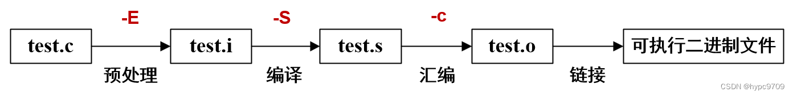
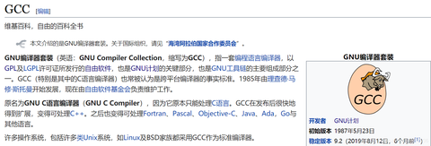
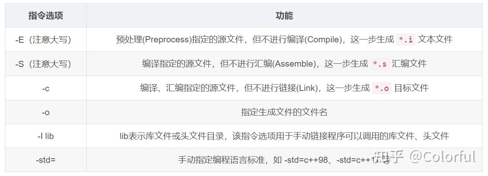

## 1. C/C++运行的四个步骤

编写完成一个C/C++程序后，想要运行起来，必须要经过四个步骤：预处理、编译、汇编和链接。每个步骤都会生成对应的文件，如下图所示（注意后缀名）：



C/C++代码编译全过程

**第3节**将通过一个简易C++工程演示图中的全过程，并解释细节。

## 2.名词解释

为了后面过程的介绍更方便，这里对C++编译过程中涉及的一些常用名词进行解释。

### 2.1 GCC、GNU、gcc与g++

- GNU：一个操作系统，具体内容不重要，感兴趣可以参考：

[GCC、GNU到底啥意思？_一只杨阳羊的博客-CSDN博客blog.csdn.net/qq_43617936/article/details/104504992](https://link.zhihu.com/?target=https%3A//blog.csdn.net/qq_43617936/article/details/104504992)

- **GCC**：GNU Compiler Collection（GNU编译器集合）的缩写，可以理解为一组GNU操作系统中的编译器集合，可以用于编译C、C++、Java、Go、Fortan、Pascal、Objective-C等语言。
- **gcc**：GCC（编译器集合）中的GNU C Compiler(C 编译器)
- **g++**：GCC（编译器集合）中的GNU C++ Compiler(C++ 编译器)

简单来说，gcc调用了GCC中的C Compiler，而g++调用了GCC中的C++ Compiler。 - 对于 `*.c` 和 `*.cpp` 文件，gcc分别当作 c 和 cpp文件编译，而g++则统一当作cpp文件编译。

### 2.2 代码编译命令

gcc/g++常用指令选项：



gcc/g++常用指令选项

### 2.3 [GDB](https://zhida.zhihu.com/search?content_id=225473028&content_type=Article&match_order=1&q=GDB&zhida_source=entity)(gdb)

GDB（gdb）全称“GNU symbolic debugger”，是 Linux 下常用的程序调试器。 为了能够使用 gdb 调试，需要在代码编译的时候加上`-g`，如

```text
g++ -g -o test test.cpp
```

本文中只演示从源代码生成可执行二进制文件的过程，暂不涉及调试过程。调试的配置会在另一篇文章中专门介绍。

## 3. C++编译过程详解

主要参考：

[C++ 预编译，编译，汇编，链接www.cnblogs.com/suxia/p/14214982.html](https://link.zhihu.com/?target=https%3A//www.cnblogs.com/suxia/p/14214982.html)

[Joe.Zhao：C/C++语言编译链接过程zhuanlan.zhihu.com/p/88255667#:~:text=C/C++%E8%AF%AD%E8%A8%80%E7%BC%96%E8%AF%91%E9%93%BE%E6%8E%A5%E8%BF%87%E7%A8%8B%201%201.%E9%A2%84%E5%A4%84%E7%90%86%20%28Preprocessing%29%20%E9%A2%84%E5%A4%84%E7%90%86%E7%94%A8%E4%BA%8E%E5%B0%86%E6%89%80%E6%9C%89%E7%9A%84#include%20%E5%A4%B4%E6%96%87%E4%BB%B6%E4%BB%A5%E5%8F%8A%E5%AE%8F%E5%AE%9A%E4%B9%89%E6%9B%BF%E6%8D%A2%E6%88%90%E5%85%B6%E7%9C%9F%E6%AD%A3%E7%9A%84%E5%86%85%E5%AE%B9%20%EF%BC%8C%E9%A2%84%E5%A4%84%E7%90%86%E4%B9%8B%E5%90%8E%E5%BE%97%E5%88%B0%E7%9A%84%E4%BB%8D%E7%84%B6%E6%98%AF%E6%96%87%E6%9C%AC%E6%96%87%E4%BB%B6%EF%BC%8C%E4%BD%86%E6%96%87%E4%BB%B6%E4%BD%93%E7%A7%AF%E4%BC%9A%E5%A4%A7%E5%BE%88%E5%A4%9A%E3%80%82%20...,%E6%88%90%E6%9C%80%E7%BB%88%E7%9A%84%20%E5%8F%AF%E6%89%A7%E8%A1%8C%E6%96%87%E4%BB%B6%20%28executable%20file%29%E3%80%82%20...%205%205.%E6%95%B0%E6%8D%AE%E5%92%8C%E6%8C%87%E4%BB%A4%20](https://zhuanlan.zhihu.com/p/88255667#:~:text=C/C++语言编译链接过程 1 1.预处理 (Preprocessing) 预处理用于将所有的#include 头文件以及宏定义替换成其真正的内容 ，预处理之后得到的仍然是文本文件，但文件体积会大很多。 ...,成最终的 可执行文件 (executable file)。 ... 5 5.数据和指令 )

本节内容用下面的简单C++工程做演示。示例的文件结构如下：

```text
|—— include
      |—— func.h
|—— src
      |—— func.cpp
|—— main.cpp
```

其中，`main.cpp`是主要代码，`include/func.h`是自定义函数的头文件，`src/func.cpp`是函数的具体实现

各个文件的内容如下：

```cpp
// main.cpp
#include <iostream>
#include "func.h"

using namespace std;

int main(){
    int a = 1;
    int b = 2;
    cout << "a + b = " << sum(a, b) << endl;; 

    return 0;
}
// func.h
#ifndef FUNC_H
#define FUNC_H

int sum(int a, int b);

#endif
// func.cpp
#include "func.h"

int sum(int a, int b) {
    return a + b;
}
```

### 3.1 预处理（Preprocess）

预处理，顾名思义就是编译前的一些准备工作。

**预编译把一些`#define`的宏定义完成文本替换，然后将**`#include`**的文件里的内容复制到`.cpp`文件里，如果`.h`文件里还有`.h`文件，就递归展开**。在预处理这一步，代码注释直接被忽略，不会进入到后续的处理中，所以注释在程序中不会执行。

gcc/g++的预处理实质上是通过**预处理器**`cpp`（应该是c preprocess的缩写?）来完成的，所以我们既可以通过`g++ -E`，也可以通过`cpp`命令对`main.cpp`进行预处理：

```bash
g++ -E -I include/ main.cpp -o main.i
# 或者直接调用 cpp 命令
cpp -I include/ main.cpp -o main.i
```

上述命令中： - `g++ -E` 是让编译器在预处理之后就退出，不进行后续编译过程，等价于`cpp`指令 - `-I include/`用于指定头文件目录 - `main.cpp`是要预处理的源文件 - `-o main.i`用于指定生成的文件名

预处理之后的程序格式为 `*.i`，仍是文本文件，可以用任意文本编辑器打开。

执行完预处理后的文件结构如下：

```text
|—— include
      |—— func.h
|—— src
      |—— func.cpp
|—— main.cpp
|—— main.i
```

### 3.2 编译（Compile）

> 编译**只是把我们写的代码转为汇编代码**，**它的工作是检查词法和语法规则，所以，如果程序没有词法或则语法错误，那么不管逻辑是怎样错误的，都不会报错**。
> **编译不是指程序从源文件到二进制程序的全部过程，而是指将经过预处理之后的程序转换成特定汇编代码(assembly code)的过程**。

编译的指令如下：

```bash
g++ -S -I include/ main.cpp -o main.s
```

与预处理类似，上述命令中： - `g++ -S`是让编译器在编译之后停止，不进行后续过程 - `-I include/`用于指定头文件目录 - `main.cpp`是要编译的源文件 - `-o main.s`用于指定生成的文件名

编译完成后，会生成程序的**汇编代码**`main.s`，**这也是文本文件**，可以直接用任意文本编辑器查看。

执行完编译后的文件结构如下：

```text
|—— include
      |—— func.h
|—— src
      |—— func.cpp
|—— main.cpp
|—— main.i
|—— main.s
```

### 3.3 汇编（Assemble）

> 汇编过程将上一步的**汇编代码**(`main.s`)**转换成机器码**(machine code)，**这一步产生的文件叫做目标文件**(`main.o`)，**是二进制格式**。

gcc/g++的汇编过程通过 `as` 命令完成，所以我们可以通过`g++ -c`或`as`命令完成汇编：

```bash
g++ -c -I include/ main.cpp -o main.o
# 或者直接调用 as 命令
as main.s -o main.o
```

上述指令中： - `g++ -c`让编译器在汇编之后退出，等价于 `as` - `-I include/`仍是用于指定头文件目录 - `main.cpp`是要汇编的源文件 - `-o main.o`用于指定生成的文件名

**汇编这一步需要为每一个源文件（本文示例代码中为`main.cpp`、`func.cpp`）产生一个目标文件。因此`func.cpp`也需要执行一次这个汇编过程产生一个`func.o`文件**:

```bash
# 可以用 g++ -c 命令一步生成 func.o
g++ -c -I include/ src/func.cpp -o src/func.o
# 当然也可以按照上面的预处理、编译、汇编三个步骤生成func.o
```

到了这一步，代码的文件结构如下：

```text
|—— include
      |—— func.h
|—— src
      |—— func.cpp
      |—— func.o
|—— main.cpp
|—— main.i
|—— main.s
|—— main.o
```

### 3.4 链接（Link）

C/C++代码经过汇编之后生成的**目标文件(`\*.o`)并不是最终的可执行二进制文件，而仍是一种中间文件(或称临时文件)，目标文件仍然需要经过链接(Link)才能变成可执行文件**。

> 既然目标文件和可执行文件的格式是一样的（都是二进制格式），为什么还要再链接一次呢？
> 因为**编译只是将我们自己写的代码变成了二进制形式，它还需要和系统组件（比如标准库、动态链接库等）结合起来，这些组件都是程序运行所必须的**。
> **链接（Link）其实就是一个“打包”的过程，它将所有二进制形式的目标文件(.o)和系统组件组合成一个可执行文件**。完成链接的过程也需要一个特殊的软件，叫做**[链接器](https://zhida.zhihu.com/search?content_id=225473028&content_type=Article&match_order=1&q=链接器&zhida_source=entity)（Linker）**。
> 此外需要注意的是：**C++程序编译的时候其实只识别`.cpp`文件，每个cpp文件都会分别编译一次，生成一个`.o`文件。这个时候，链接器除了将目标文件和系统组件组合起来，还需要将编译器生成的多个`.o`或者`.obj`文件组合起来**，**生成最终的可执行文件(Executable file)**。

以本文中的代码为例，将`func.o`和`main.o`链接成可执行文件`main.out`，指令如下:

```bash
g++ src/func.o main.o -o main.out
```

- `-o main.out`用于指定生成的可执行二进制文件名
- 由于`g++`自动链接了系统组件，所以我们只需要把自定义函数的目标文件与`main.o`链接即可。

运行`main.out`，结果如下：

```bash
./main.out
a + b = 3
```

### 3.5 小结

从上面的介绍可以看出，从C++源代码到最终的可执行文件的中间过程并不简单。了解预处理、编译、汇编、链接各个步骤的作用有助于我们处理更加复杂的项目工程。

不过也不必被这么麻烦的编译过程劝退，当我们编译简单`.cpp`代码时，

```cpp
// hello.cpp
#include <iostream>
using namespace std;

int main(){
    cout << "Hello, world!" << endl;
    return 0;
}
```

仍然可以直接使用`g++`命令生成可执行文件，而不必考虑中间过程：

```bash
g++ hello.cpp -o hello
./hello
Hello, world!
```

## 4. 参考教程

1. [GCC、GNU到底啥意思？](https://link.zhihu.com/?target=https%3A//blog.csdn.net/qq_43617936/article/details/104504992)
2. [C++ 预编译，编译，汇编，链接](https://link.zhihu.com/?target=https%3A//www.cnblogs.com/suxia/p/14214982.html)
3. [C/C++语言编译链接过程](https://zhuanlan.zhihu.com/p/88255667#:~:text=C/C++语言编译链接过程 1 1.预处理 (Preprocessing) 预处理用于将所有的#include 头文件以及宏定义替换成其真正的内容 ，预处理之后得到的仍然是文本文件，但文件体积会大很多。 ...,成最终的 可执行文件 (executable file)。 ... 5 5.数据和指令 )