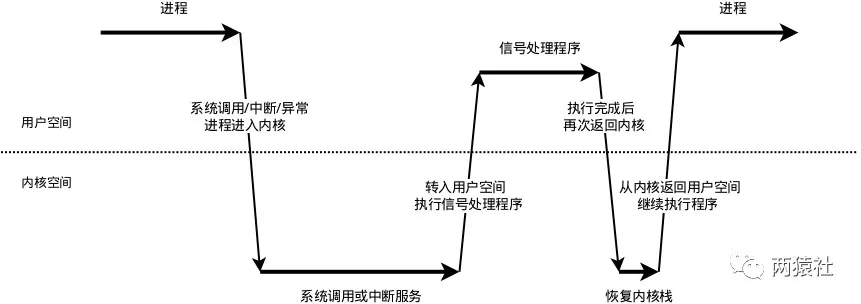

# 最新版Web服务器项目详解 - 07 定时器处理非活动连接（上）

Original 互联网猿 

[两猿社](javascript:void(0);)

 *2020年04月22日 11:50*

点 击 关 注 上 方＂**两猿社**＂

设 为＂**置 顶 或 星 标**＂，干 货 第 一 时 间 送 达。


互 联 网 猿 | 两 猿 社

### 基础知识

`非活跃`，是指客户端（这里是浏览器）与服务器端建立连接后，长时间不交换数据，一直占用服务器端的文件描述符，导致连接资源的浪费。

`定时事件`，是指固定一段时间之后触发某段代码，由该段代码处理一个事件，如从内核事件表删除事件，并关闭文件描述符，释放连接资源。

`定时器`，是指利用结构体或其他形式，将多种定时事件进行封装起来。具体的，这里只涉及一种定时事件，即定期检测非活跃连接，这里将该定时事件与连接资源封装为一个结构体定时器。

`定时器容器`，是指使用某种容器类数据结构，将上述多个定时器组合起来，便于对定时事件统一管理。具体的，项目中使用升序链表将所有定时器串联组织起来。

### 整体概述

本项目中，服务器主循环为每一个连接创建一个定时器，并对每个连接进行定时。另外，利用升序时间链表容器将所有定时器串联起来，若主循环接收到定时通知，则在链表中依次执行定时任务。

`Linux`下提供了三种定时的方法:

- socket选项SO_RECVTIMEO和SO_SNDTIMEO
- SIGALRM信号
- I/O复用系统调用的超时参数

三种方法没有一劳永逸的应用场景，也没有绝对的优劣。由于项目中使用的是`SIGALRM`信号，这里仅对其进行介绍，另外两种方法可以查阅游双的`Linux高性能服务器编程 第11章 定时器`。

具体的，利用`alarm`函数周期性地触发`SIGALRM`信号，信号处理函数利用管道通知主循环，主循环接收到该信号后对升序链表上所有定时器进行处理，若该段时间内没有交换数据，则将该连接关闭，释放所占用的资源。

从上面的简要描述中，可以看出定时器处理非活动连接模块，主要分为两部分，其一为定时方法与信号通知流程，其二为定时器及其容器设计与定时任务的处理。

### 本文内容

本篇将介绍定时方法与信号通知流程，具体的涉及到基础API、信号通知流程和代码实现。

**基础API**，描述`sigaction`结构体、`sigaction`函数、`sigfillset`函数、`SIGALRM`信号、`SIGTERM`信号、`alarm`函数、`socketpair`函数、`send`函数。

**信号通知流程**，介绍统一事件源和信号处理机制。

**代码实现**，结合代码对信号处理函数的设计与使用进行详解。

### 基础API

为了更好的源码阅读体验，这里提前对代码中使用的一些API进行简要介绍，更丰富的用法可以自行查阅资料。

#### **sigaction结构体**

```
1struct sigaction {
2    void (*sa_handler)(int);
3    void (*sa_sigaction)(int, siginfo_t *, void *);
4    sigset_t sa_mask;
5    int sa_flags;
6    void (*sa_restorer)(void);
7}
```


- sa_handler是一个函数指针，指向信号处理函数
- sa_sigaction同样是信号处理函数，有三个参数，可以获得关于信号更详细的信息
- sa_mask用来指定在信号处理函数执行期间需要被屏蔽的信号
- sa_flags用于指定信号处理的行为
  - SA_RESTART，使被信号打断的系统调用自动重新发起
  - SA_NOCLDSTOP，使父进程在它的子进程暂停或继续运行时不会收到 SIGCHLD 信号
  - SA_NOCLDWAIT，使父进程在它的子进程退出时不会收到 SIGCHLD 信号，这时子进程如果退出也不会成为僵尸进程
  - SA_NODEFER，使对信号的屏蔽无效，即在信号处理函数执行期间仍能发出这个信号
  - SA_RESETHAND，信号处理之后重新设置为默认的处理方式
  - SA_SIGINFO，使用 sa_sigaction 成员而不是 sa_handler 作为信号处理函数
- sa_restorer一般不使用

#### **sigaction函数**

```
1#include <signal.h>
2
3int sigaction(int signum, const struct sigaction *act, struct sigaction *oldact);
```


- signum表示操作的信号。
- act表示对信号设置新的处理方式。
- oldact表示信号原来的处理方式。
- 返回值，0 表示成功，-1 表示有错误发生。

#### **sigfillset函数**

```
1#include <signal.h>
2
3int sigfillset(sigset_t *set);
```

用来将参数set信号集初始化，然后把所有的信号加入到此信号集里。

#### **SIGALRM、SIGTERM信号**

```
1#define SIGALRM  14     //由alarm系统调用产生timer时钟信号
2#define SIGTERM  15     //终端发送的终止信号
```

#### **alarm函数**

```
1#include <unistd.h>;
2
3unsigned int alarm(unsigned int seconds);
```

设置信号传送闹钟，即用来设置信号SIGALRM在经过参数seconds秒数后发送给目前的进程。如果未设置信号SIGALRM的处理函数，那么alarm()默认处理终止进程.

#### **socketpair函数**

在linux下，使用socketpair函数能够创建一对套接字进行通信，项目中使用管道通信。

```
1#include <sys/types.h>
2#include <sys/socket.h>
3
4int socketpair(int domain, int type, int protocol, int sv[2]);
```


- domain表示协议族，PF_UNIX或者AF_UNIX
- type表示协议，可以是SOCK_STREAM或者SOCK_DGRAM，SOCK_STREAM基于TCP，SOCK_DGRAM基于UDP
- protocol表示类型，只能为0
- sv[2]表示套节字柄对，该两个句柄作用相同，均能进行读写双向操作
- 返回结果， 0为创建成功，-1为创建失败

#### **send函数**

```
1#include <sys/types.h>
2#include <sys/socket.h>
3
4ssize_t send(int sockfd, const void *buf, size_t len, int flags);
```

当套接字发送缓冲区变满时，send通常会阻塞，除非套接字设置为非阻塞模式，当缓冲区变满时，返回EAGAIN或者EWOULDBLOCK错误，此时可以调用select函数来监视何时可以发送数据。

### 信号通知流程

Linux下的信号采用的异步处理机制，信号处理函数和当前进程是两条不同的执行路线。具体的，当进程收到信号时，操作系统会中断进程当前的正常流程，转而进入信号处理函数执行操作，完成后再返回中断的地方继续执行。

为避免信号竞态现象发生，信号处理期间系统不会再次触发它。所以，为确保该信号不被屏蔽太久，信号处理函数需要尽可能快地执行完毕。

一般的信号处理函数需要处理该信号对应的逻辑，当该逻辑比较复杂时，信号处理函数执行时间过长，会导致信号屏蔽太久。

这里的解决方案是，信号处理函数仅仅发送信号通知程序主循环，将信号对应的处理逻辑放在程序主循环中，由主循环执行信号对应的逻辑代码。

#### **统一事件源**

统一事件源，是指将信号事件与其他事件一样被处理。

具体的，信号处理函数使用管道将信号传递给主循环，信号处理函数往管道的写端写入信号值，主循环则从管道的读端读出信号值，使用I/O复用系统调用来监听管道读端的可读事件，这样信号事件与其他文件描述符都可以通过epoll来监测，从而实现统一处理。

#### **信号处理机制**

每个进程之中，都有存着一个表，里面存着每种信号所代表的含义，内核通过设置表项中每一个位来标识对应的信号类型。



- 信号的接收
  - 接收信号的任务是由内核代理的，当内核接收到信号后，会将其放到对应进程的信号队列中，同时向进程发送一个中断，使其陷入内核态。注意，此时信号还只是在队列中，对进程来说暂时是不知道有信号到来的。
- 信号的检测
  - 进程从内核态返回到用户态前进行信号检测
  - 进程在内核态中，从睡眠状态被唤醒的时候进行信号检测
  - 进程陷入内核态后，有两种场景会对信号进行检测：
  - 当发现有新信号时，便会进入下一步，信号的处理。
- 信号的处理
  - ( **内核** )信号处理函数是运行在用户态的，调用处理函数前，内核会将当前内核栈的内容备份拷贝到用户栈上，并且修改指令寄存器（eip）将其指向信号处理函数。
  - ( **用户** )接下来进程返回到用户态中，执行相应的信号处理函数。
  - ( **内核** )信号处理函数执行完成后，还需要返回内核态，检查是否还有其它信号未处理。
  - ( **用户** )如果所有信号都处理完成，就会将内核栈恢复（从用户栈的备份拷贝回来），同时恢复指令寄存器（eip）将其指向中断前的运行位置，最后回到用户态继续执行进程。

至此，一个完整的信号处理流程便结束了，如果同时有多个信号到达，上面的处理流程会在第2步和第3步骤间重复进行。

### 代码分析

#### **信号处理函数** 

自定义信号处理函数，创建sigaction结构体变量，设置信号函数。

```
 1//信号处理函数
 2void sig_handler(int sig)
 3{
 4    //为保证函数的可重入性，保留原来的errno
 5    //可重入性表示中断后再次进入该函数，环境变量与之前相同，不会丢失数据
 6    int save_errno = errno;
 7    int msg = sig;
 8
 9    //将信号值从管道写端写入，传输字符类型，而非整型
10    send(pipefd[1], (char *)&msg, 1, 0);
11
12    //将原来的errno赋值为当前的errno
13    errno = save_errno;
14}
```

信号处理函数中仅仅通过管道发送信号值，不处理信号对应的逻辑，缩短异步执行时间，减少对主程序的影响。

```
 1//设置信号函数
 2void addsig(int sig, void(handler)(int), bool restart = true)
 3{
 4    //创建sigaction结构体变量
 5    struct sigaction sa;
 6    memset(&sa, '\0', sizeof(sa));
 7
 8    //信号处理函数中仅仅发送信号值，不做对应逻辑处理
 9    sa.sa_handler = handler;
10    if (restart)
11        sa.sa_flags |= SA_RESTART;
12    //将所有信号添加到信号集中
13    sigfillset(&sa.sa_mask);
14
15    //执行sigaction函数
16    assert(sigaction(sig, &sa, NULL) != -1);
17}
```

项目中设置信号函数，仅关注SIGTERM和SIGALRM两个信号。

#### **信号通知逻辑**

- 创建管道，其中管道写端写入信号值，管道读端通过I/O复用系统监测读事件
- 设置信号处理函数SIGALRM（时间到了触发）和SIGTERM（kill会触发，Ctrl+C）
  - 通过struct sigaction结构体和sigaction函数注册信号捕捉函数
  - 在结构体的handler参数设置信号处理函数，具体的，从管道写端写入信号的名字
- 利用I/O复用系统监听管道读端文件描述符的可读事件
- 信息值传递给主循环，主循环再根据接收到的信号值执行目标信号对应的逻辑代码

#### **代码分析**

```
 1//创建管道套接字
 2ret = socketpair(PF_UNIX, SOCK_STREAM, 0, pipefd);
 3assert(ret != -1);
 4
 5//设置管道写端为非阻塞，为什么写端要非阻塞？
 6setnonblocking(pipefd[1]);
 7
 8//设置管道读端为ET非阻塞
 9addfd(epollfd, pipefd[0], false);
10
11//传递给主循环的信号值，这里只关注SIGALRM和SIGTERM
12addsig(SIGALRM, sig_handler, false);
13addsig(SIGTERM, sig_handler, false);
14
15//循环条件
16bool stop_server = false;
17
18//超时标志
19bool timeout = false;
20
21//每隔TIMESLOT时间触发SIGALRM信号
22alarm(TIMESLOT);
23
24while (!stop_server)
25{
26    //监测发生事件的文件描述符
27    int number = epoll_wait(epollfd, events, MAX_EVENT_NUMBER, -1);
28    if (number < 0 && errno != EINTR)
29    {
30        break;
31    }
32
33    //轮询文件描述符
34    for (int i = 0; i < number; i++)
35    {
36        int sockfd = events[i].data.fd;
37
38        //管道读端对应文件描述符发生读事件
39        if ((sockfd == pipefd[0]) && (events[i].events & EPOLLIN))
40        {
41            int sig;
42            char signals[1024];
43
44            //从管道读端读出信号值，成功返回字节数，失败返回-1
45            //正常情况下，这里的ret返回值总是1，只有14和15两个ASCII码对应的字符
46            ret = recv(pipefd[0], signals, sizeof(signals), 0);
47            if (ret == -1)
48            {
49                // handle the error
50                continue;
51            }
52            else if (ret == 0)
53            {
54                continue;
55            }
56            else
57            {
58                //处理信号值对应的逻辑
59                for (int i = 0; i < ret; ++i)
60                {
61                    //这里面明明是字符
62                    switch (signals[i])
63                    {
64                    //这里是整型
65                    case SIGALRM:
66                    {
67                        timeout = true;
68                        break;
69                    }
70                    case SIGTERM:
71                    {
72                        stop_server = true;
73                    }
74                    }
75                }
76            }
77        }
78    }
79}
```

**为什么管道写端要非阻塞？**

send是将信息发送给套接字缓冲区，如果缓冲区满了，则会阻塞，这时候会进一步增加信号处理函数的执行时间，为此，将其修改为非阻塞。

**没有对非阻塞返回值处理，如果阻塞是不是意味着这一次定时事件失效了？**

是的，但定时事件是非必须立即处理的事件，可以允许这样的情况发生。

**管道传递的是什么类型？switch-case的变量冲突？**

信号本身是整型数值，管道中传递的是ASCII码表中整型数值对应的字符。

switch的变量一般为字符或整型，当switch的变量为字符时，case中可以是字符，也可以是字符对应的ASCII码。

如果本文对你有帮助，`阅读原文`star一下服务器项目，我们需要你的星星^_^.

完。

# 最新版Web服务器项目详解 - 08 定时器处理非活动连接（下）

Original 互联网猿 

[两猿社](javascript:void(0);)

 *2020年04月22日 11:50*

点 击 关 注 上 方＂**两猿社**＂

设 为＂**置 顶 或 星 标**＂，干 货 第 一 时 间 送 达。


互 联 网 猿 | 两 猿 社

### 本文内容

定时器处理非活动连接模块，主要分为两部分，其一为定时方法与信号通知流程，其二为定时器及其容器设计、定时任务的处理。

本篇对第二部分进行介绍，具体的涉及到定时器设计、容器设计、定时任务处理函数和使用定时器。

`定时器设计`，将连接资源和定时事件等封装起来，具体包括连接资源、超时时间和回调函数，这里的回调函数指向定时事件。

`定时器容器设计`，将多个定时器串联组织起来统一处理，具体包括升序链表设计。

`定时任务处理函数`，该函数封装在容器类中，具体的，函数遍历升序链表容器，根据超时时间，处理对应的定时器。

`代码分析-使用定时器`，通过代码分析，如何在项目中使用定时器。

### 定时器设计

项目中将连接资源、定时事件和超时时间封装为定时器类，具体的，

- 连接资源包括客户端套接字地址、文件描述符和定时器
- 定时事件为回调函数，将其封装起来由用户自定义，这里是删除非活动socket上的注册事件，并关闭
- 定时器超时时间 = 浏览器和服务器连接时刻 + 固定时间(TIMESLOT)，可以看出，定时器使用绝对时间作为超时值，这里alarm设置为5秒，连接超时为15秒。


```
 1//连接资源结构体成员需要用到定时器类
 2//需要前向声明
 3class util_timer;
 4
 5//连接资源
 6struct client_data
 7{
 8    //客户端socket地址
 9    sockaddr_in address;
10
11    //socket文件描述符
12    int sockfd;
13
14    //定时器
15    util_timer* timer;
16};
17
18//定时器类
19class util_timer
20{
21public:
22    util_timer() : prev( NULL ), next( NULL ){}
23
24public:
25    //超时时间
26    time_t expire; 
27    //回调函数
28    void (*cb_func)( client_data* );
29    //连接资源
30    client_data* user_data;
31    //前向定时器
32    util_timer* prev;
33    //后继定时器
34    util_timer* next;
35};
```

定时事件，具体的，从内核事件表删除事件，关闭文件描述符，释放连接资源。

```
 1//定时器回调函数
 2void cb_func(client_data *user_data)
 3{
 4    //删除非活动连接在socket上的注册事件
 5    epoll_ctl(epollfd, EPOLL_CTL_DEL, user_data->sockfd, 0);
 6    assert(user_data);
 7
 8    //关闭文件描述符
 9    close(user_data->sockfd);
10
11    //减少连接数
12    http_conn::m_user_count--;
13}
```

### 定时器容器设计

项目中的定时器容器为带头尾结点的升序双向链表，具体的为每个连接创建一个定时器，将其添加到链表中，并按照超时时间升序排列。执行定时任务时，将到期的定时器从链表中删除。

从实现上看，主要涉及双向链表的插入，删除操作，其中添加定时器的事件复杂度是O(n),删除定时器的事件复杂度是O(1)。

升序双向链表主要逻辑如下，具体的，

- 创建头尾节点，其中头尾节点没有意义，仅仅统一方便调整
- add_timer函数，将目标定时器添加到链表中，添加时按照升序添加
  - 若当前链表中只有头尾节点，直接插入
  - 否则，将定时器按升序插入
- adjust_timer函数，当定时任务发生变化,调整对应定时器在链表中的位置
  - 客户端在设定时间内有数据收发,则当前时刻对该定时器重新设定时间，这里只是往后延长超时时间
  - 被调整的目标定时器在尾部，或定时器新的超时值仍然小于下一个定时器的超时，不用调整
  - 否则先将定时器从链表取出，重新插入链表
- del_timer函数将超时的定时器从链表中删除
  - 常规双向链表删除结点


```
  1//定时器容器类
  2class sort_timer_lst
  3{
  4public:
  5    sort_timer_lst() : head( NULL ), tail( NULL ) {}
  6    //常规销毁链表
  7    ~sort_timer_lst()
  8    {
  9        util_timer* tmp = head;
 10        while( tmp )
 11        {
 12            head = tmp->next;
 13            delete tmp;
 14            tmp = head;
 15        }
 16    }
 17
 18    //添加定时器，内部调用私有成员add_timer
 19    void add_timer( util_timer* timer )
 20    {
 21        if( !timer )
 22        {
 23            return;
 24        }
 25        if( !head )
 26        {
 27            head = tail = timer;
 28            return; 
 29        }
 30
 31        //如果新的定时器超时时间小于当前头部结点
 32        //直接将当前定时器结点作为头部结点
 33        if( timer->expire < head->expire )
 34        {
 35            timer->next = head;
 36            head->prev = timer;
 37            head = timer;
 38            return;
 39        }
 40
 41        //否则调用私有成员，调整内部结点
 42        add_timer( timer, head );
 43    }
 44
 45    //调整定时器，任务发生变化时，调整定时器在链表中的位置
 46    void adjust_timer( util_timer* timer )
 47    {
 48        if( !timer )
 49        {
 50            return;
 51        }
 52        util_timer* tmp = timer->next;
 53
 54        //被调整的定时器在链表尾部
 55        //定时器超时值仍然小于下一个定时器超时值，不调整
 56        if( !tmp || ( timer->expire < tmp->expire ) )
 57        {
 58            return;
 59        }
 60
 61        //被调整定时器是链表头结点，将定时器取出，重新插入
 62        if( timer == head )
 63        {
 64            head = head->next;
 65            head->prev = NULL;
 66            timer->next = NULL;
 67            add_timer( timer, head );
 68        }
 69
 70        //被调整定时器在内部，将定时器取出，重新插入
 71        else
 72        {
 73            timer->prev->next = timer->next;
 74            timer->next->prev = timer->prev;
 75            add_timer( timer, timer->next );
 76        }
 77    }
 78
 79    //删除定时器
 80    void del_timer( util_timer* timer )
 81    {
 82        if( !timer )
 83        {
 84            return;
 85        }
 86
 87        //链表中只有一个定时器，需要删除该定时器
 88        if( ( timer == head ) && ( timer == tail ) )
 89        {
 90            delete timer;
 91            head = NULL;
 92            tail = NULL;
 93            return;
 94        }
 95
 96        //被删除的定时器为头结点
 97        if( timer == head )
 98        {
 99            head = head->next;
100            head->prev = NULL;
101            delete timer;
102            return;
103        }
104
105        //被删除的定时器为尾结点
106        if( timer == tail )
107        {
108            tail = tail->prev;
109            tail->next = NULL;
110            delete timer;
111            return;
112        }
113
114        //被删除的定时器在链表内部，常规链表结点删除
115        timer->prev->next = timer->next;
116        timer->next->prev = timer->prev;
117        delete timer;
118    }
119
120private:
121    //私有成员，被公有成员add_timer和adjust_time调用
122    //主要用于调整链表内部结点
123    void add_timer( util_timer* timer, util_timer* lst_head )
124    {
125        util_timer* prev = lst_head;
126        util_timer* tmp = prev->next;
127
128        //遍历当前结点之后的链表，按照超时时间找到目标定时器对应的位置，常规双向链表插入操作
129        while( tmp )
130        {
131            if( timer->expire < tmp->expire )
132            {
133                prev->next = timer;
134                timer->next = tmp;
135                tmp->prev = timer;
136                timer->prev = prev;
137                break;
138            }
139            prev = tmp;
140            tmp = tmp->next;
141        }
142
143        //遍历完发现，目标定时器需要放到尾结点处
144        if( !tmp )
145        {
146            prev->next = timer;
147            timer->prev = prev;
148            timer->next = NULL;
149            tail = timer;
150        }
151
152    }
153
154private:
155    //头尾结点
156    util_timer* head;
157    util_timer* tail;
158};
```

### 定时任务处理函数

使用统一事件源，SIGALRM信号每次被触发，主循环中调用一次定时任务处理函数，处理链表容器中到期的定时器。

具体的逻辑如下，

- 遍历定时器升序链表容器，从头结点开始依次处理每个定时器，直到遇到尚未到期的定时器
- 若当前时间小于定时器超时时间，跳出循环，即未找到到期的定时器
- 若当前时间大于定时器超时时间，即找到了到期的定时器，执行回调函数，然后将它从链表中删除，然后继续遍历


```
 1//定时任务处理函数
 2void tick()
 3{
 4    if( !head )
 5    {
 6        return;
 7    }
 8
 9    //获取当前时间
10    time_t cur = time( NULL );
11    util_timer* tmp = head;
12
13    //遍历定时器链表
14    while( tmp )
15    {
16        //链表容器为升序排列
17        //当前时间小于定时器的超时时间，后面的定时器也没有到期
18        if( cur < tmp->expire )
19        {
20            break;
21        }
22
23        //当前定时器到期，则调用回调函数，执行定时事件
24        tmp->cb_func( tmp->user_data );
25
26        //将处理后的定时器从链表容器中删除，并重置头结点
27        head = tmp->next;
28        if( head )
29        {
30            head->prev = NULL;
31        }
32        delete tmp;
33        tmp = head;
34    }
35}
```

### 代码分析-如何使用定时器

服务器首先创建定时器容器链表，然后用统一事件源将异常事件，读写事件和信号事件统一处理，根据不同事件的对应逻辑使用定时器。

具体的，

- 浏览器与服务器连接时，创建该连接对应的定时器，并将该定时器添加到链表上
- 处理异常事件时，执行定时事件，服务器关闭连接，从链表上移除对应定时器
- 处理定时信号时，将定时标志设置为true
- 处理读事件时，若某连接上发生读事件，将对应定时器向后移动，否则，执行定时事件
- 处理写事件时，若服务器通过某连接给浏览器发送数据，将对应定时器向后移动，否则，执行定时事件


```
  1//定时处理任务，重新定时以不断触发SIGALRM信号
  2void timer_handler()
  3{
  4    timer_lst.tick();
  5    alarm(TIMESLOT);
  6}
  7
  8//创建定时器容器链表
  9static sort_timer_lst timer_lst;
 10
 11//创建连接资源数组
 12client_data *users_timer = new client_data[MAX_FD];
 13
 14//超时默认为False
 15bool timeout = false;
 16
 17//alarm定时触发SIGALRM信号
 18alarm(TIMESLOT);
 19
 20while (!stop_server)
 21{
 22    int number = epoll_wait(epollfd, events, MAX_EVENT_NUMBER, -1);
 23    if (number < 0 && errno != EINTR)
 24    {
 25        break;
 26    }
 27
 28    for (int i = 0; i < number; i++)
 29    {
 30        int sockfd = events[i].data.fd;
 31
 32        //处理新到的客户连接
 33        if (sockfd == listenfd)
 34        {
 35            //初始化客户端连接地址
 36            struct sockaddr_in client_address;
 37            socklen_t client_addrlength = sizeof(client_address);
 38
 39            //该连接分配的文件描述符
 40            int connfd = accept(listenfd, (struct sockaddr *)&client_address, &client_addrlength);
 41
 42            //初始化该连接对应的连接资源
 43            users_timer[connfd].address = client_address;
 44            users_timer[connfd].sockfd = connfd;
 45
 46            //创建定时器临时变量
 47            util_timer *timer = new util_timer;
 48            //设置定时器对应的连接资源
 49            timer->user_data = &users_timer[connfd];
 50            //设置回调函数
 51            timer->cb_func = cb_func;
 52
 53            time_t cur = time(NULL);
 54            //设置绝对超时时间
 55            timer->expire = cur + 3 * TIMESLOT;
 56            //创建该连接对应的定时器，初始化为前述临时变量
 57            users_timer[connfd].timer = timer;
 58            //将该定时器添加到链表中
 59            timer_lst.add_timer(timer);
 60        }
 61        //处理异常事件
 62        else if (events[i].events & (EPOLLRDHUP | EPOLLHUP | EPOLLERR))
 63        {
 64            //服务器端关闭连接，移除对应的定时器
 65            cb_func(&users_timer[sockfd]);
 66
 67            util_timer *timer = users_timer[sockfd].timer;
 68            if (timer)
 69            {
 70                timer_lst.del_timer(timer);
 71            }
 72        }
 73
 74        //处理定时器信号
 75        else if ((sockfd == pipefd[0]) && (events[i].events & EPOLLIN))
 76        {
 77            //接收到SIGALRM信号，timeout设置为True
 78        }
 79
 80        //处理客户连接上接收到的数据
 81        else if (events[i].events & EPOLLIN)
 82        {
 83            //创建定时器临时变量，将该连接对应的定时器取出来
 84            util_timer *timer = users_timer[sockfd].timer;
 85            if (users[sockfd].read_once())
 86            {
 87                //若监测到读事件，将该事件放入请求队列
 88                pool->append(users + sockfd);
 89
 90                //若有数据传输，则将定时器往后延迟3个单位
 91                //对其在链表上的位置进行调整
 92                if (timer)
 93                {
 94                    time_t cur = time(NULL);
 95                    timer->expire = cur + 3 * TIMESLOT;
 96                    timer_lst.adjust_timer(timer);
 97                }
 98            }
 99            else
100            {
101                //服务器端关闭连接，移除对应的定时器
102                cb_func(&users_timer[sockfd]);
103                if (timer)
104                {
105                    timer_lst.del_timer(timer);
106                }
107            }
108        }
109       else if (events[i].events & EPOLLOUT)
110       {
111           util_timer *timer = users_timer[sockfd].timer;
112           if (users[sockfd].write())
113           {
114                //若有数据传输，则将定时器往后延迟3个单位
115                //并对新的定时器在链表上的位置进行调整
116                if (timer)
117                {
118                    time_t cur = time(NULL);
119                    timer->expire = cur + 3 * TIMESLOT;
120                    timer_lst.adjust_timer(timer);
121                }
122            }
123            else
124            {
125                //服务器端关闭连接，移除对应的定时器
126                cb_func(&users_timer[sockfd]);
127                if (timer)
128                {
129                    timer_lst.del_timer(timer);
130                }
131            }
132       }
133    }
134    //处理定时器为非必须事件，收到信号并不是立马处理
135    //完成读写事件后，再进行处理
136    if (timeout)
137    {
138        timer_handler();
139        timeout = false;
140    }
141}
```

**有小伙伴问，连接资源中的address是不是有点鸡肋？**

确实如此，项目中虽然对该变量赋值，但并没有用到。类似的，可以对比HTTP类中address属性，只在日志输出中用到。

但不能说这个变量没有用，因为我们可以找到客户端连接的ip地址，用它来做一些业务，比如通过ip来判断是否异地登录等等。

如果本文对你有帮助，`阅读原文`star一下服务器项目，我们需要你的星星^_^.

完。

' fill='%23FFFFFF'%3E%3Crect x='249' y='126' width='1' height='1'%3E%3C/rect%3E%3C/g%3E%3C/g%3E%3C/svg%3E)