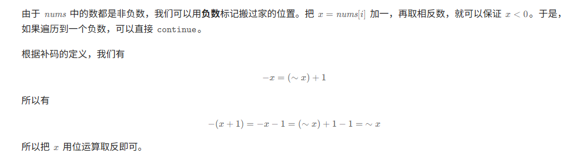

# 2025年4月1日15点10分 [2140. 解决智力问题](https://leetcode.cn/problems/solving-questions-with-brainpower/) 动态规划

从后往前的动态规划，但是我想了一个从前往后的，效率不高

# 2025年4月3日13点16分 [2874. 有序三元组中的最大值 II](https://leetcode.cn/problems/maximum-value-of-an-ordered-triplet-ii/) 贪心

还是贪心算法，但是贪心选择的对象还是没找到感觉

# 2025年4月6日15点54分[368. 最大整除子集](https://leetcode.cn/problems/largest-divisible-subset/) 动态规划（不是并查集）

动态规划的题目也不一定时间复杂度为O(n)，有可能比较大的，例如排序，还是题目理解问题不清楚，没有找到适合的模型，选用并查集，但是显然除数之间没有传递关系，导致出错，但是巩固了vector的基本操作

```
class Solution {
private:
    vector<int>flag;
    unordered_map<int,int>mp;
public:
    bool is_satisfie_condition(int num1,int num2){
        if(num1%num2 == 0){
            return true;
        }
        if(num2%num1 == 0){
            return true;
        }
        return false;
    }
    void compute(int num,int i){
        bool is_change = false;
        for(auto it=mp.begin();it!=mp.end();){
           
            if(is_satisfie_condition(it->first,num)){
                 cout<<it->first<<" "<<num<<endl;
                int temp_count = it->second;
                // cout<<it->first<<endl;
                is_change = true;
                if(it->first>num){
                    mp[num] = temp_count+1;
                    it = mp.erase(it);
                }else{
                    it->second += 1;
                    flag[i] = it->first;
                }
                break;
            }else{
                it++;
            }
        }
        if(!is_change){
            mp[num] = 1;
        }
    }
    vector<int> largestDivisibleSubset(vector<int>& nums) {
        // auto cmp = [](auto &num1,auto &num2)->bool{
        //     return num1.second<num2.second;
        // }
        int n = nums.size();
        mp[nums[0]] = 1;
        flag.assign(n,-1);
        for(int i=1; i<n ; i++){
            compute(nums[i],i);
        }
        sort(nums.begin(),nums.end());
        vector<int>res;
        int num_select = (mp.begin())->first;
        for(auto it=mp.begin();it!=mp.end();it++){
            if(num_select<it->second){
                num_select = it->first;
            }
        }
        for(int i=0 ; i<n ;i++){
            if(flag[i] == num_select){
                res.push_back(nums[i]);
            }
        }
        return res;
    }
};
```

# 2025年4月7日15点38分[416. 分割等和子集](https://leetcode.cn/problems/partition-equal-subset-sum/) 动态规划（试了贪心、深度搜索）

经典的背包问题，然后就是题目示例并没有看透彻，依然着急写代码了。  

给你一个 **只包含正整数** 的 **非空** 数组 `nums` 。请你判断是否可以将这个数组分割成两个子集，使得两个子集的元素和相等。

**示例 1：**

```
输入：nums = [1,5,11,5]
输出：true
解释：数组可以分割成 [1, 5, 5] 和 [11] 。
```

**示例 2：**

```
输入：nums = [1,2,3,5]
输出：false
解释：数组不能分割成两个元素和相等的子集。
```

```
class Solution {
public:
	//深度搜索
    bool dfs(vector<int>& nums,int sum,int temp_sum,int index)
    {
        if(temp_sum == sum){
            return true;
        }
        if(temp_sum>sum){
            return false;
        }
        int n = nums.size();
        if(index == n){
            return false;
        }
        bool res = false;
        for(int i=index ; i<n ; i++){
            res |= dfs(nums,sum,temp_sum+nums[i],i+1);
            res |= dfs(nums,sum,temp_sum,i+1);
        }
        return res;
    }
    bool canPartition(vector<int>& nums) {
        int sum = 0;
        int n = nums.size();
        sum = accumulate(nums.begin(),nums.end(),0);
        // sort(nums.begin(),nums.end());
        if(sum/2*2!=sum){
            return false;
        }
        int temp_sum = 0;
        sum /= 2;
        vector<bool>dp(sum+1,false);
        dp[0] = true;
        for(int i=0 ; i<n ; i++){
            int num = nums[i];
            for(int j=sum ; j>=num ; j--){
                dp[j] = dp[j-num]||dp[j];
            }
        } 
        //贪心
        // for(int i=0 ; i<n ; i++){
        //     temp_sum+=nums[i];
        //     if(temp_sum == sum){
        //         return true;
        //     }
        //     if(temp_sum > sum){
        //         break;
        //     }
        // }
        // for(int i=0 ; i<n ; i++){
        //     temp_sum+=nums[i];
        //     dp[i] = temp_sum;
        //     for(int j=0 ; j<i ; j++){
        //         if(dp[i] - dp[j] == sum){
        //             return true;
        //         }
        //         if(dp[i]-dp[j]<sum){
        //             break;
        //         }
        //     }
        // }
        
        return dp[sum];
    }
};
```

# 2025年4月10日15点46分 [2999. 统计强大整数的数目](https://leetcode.cn/problems/count-the-number-of-powerful-integers/)（动态规划、数学组合、区间）

没有找到合适的区间解决办法，动态规划更是太过复杂。其实也想到了按位贪心计数，但是奈何不知道用区间结果相减的方法，绕进去了


给你三个整数 `start` ，`finish` 和 `limit` 。同时给你一个下标从 **0** 开始的字符串 `s` ，表示一个 **正** 整数。

如果一个 **正** 整数 `x` 末尾部分是 `s` （换句话说，`s` 是 `x` 的 **后缀**），且 `x` 中的每个数位至多是 `limit` ，那么我们称 `x` 是 **强大的** 。

请你返回区间 `[start..finish]` 内强大整数的 **总数目** 。

如果一个字符串 `x` 是 `y` 中某个下标开始（**包括** `0` ），到下标为 `y.length - 1` 结束的子字符串，那么我们称 `x` 是 `y` 的一个后缀。比方说，`25` 是 `5125` 的一个后缀，但不是 `512` 的后缀。

**示例 1：**

```
输入：start = 1, finish = 6000, limit = 4, s = "124"
输出：5
解释：区间 [1..6000] 内的强大数字为 124 ，1124 ，2124 ，3124 和 4124 。这些整数的各个数位都 <= 4 且 "124" 是它们的后缀。注意 5124 不是强大整数，因为第一个数位 5 大于 4 。
这个区间内总共只有这 5 个强大整数。
```

**示例 2：**

```
输入：start = 15, finish = 215, limit = 6, s = "10"
输出：2
解释：区间 [15..215] 内的强大整数为 110 和 210 。这些整数的各个数位都 <= 6 且 "10" 是它们的后缀。
这个区间总共只有这 2 个强大整数。
```

**示例 3：**

```
输入：start = 1000, finish = 2000, limit = 4, s = "3000"
输出：0
解释：区间 [1000..2000] 内的整数都小于 3000 ，所以 "3000" 不可能是这个区间内任何整数的后缀。
```

# 2025年4月12日14点50分 [3272. 统计好整数的数目](https://leetcode.cn/problems/find-the-count-of-good-integers/) （排列组合化简）

复习了排列组合，以及其排列组合可以化简，比较巧妙的是针对比较死的区间，以及不一定需要遍历所有元素，也可以看看是否可以构造

[3272. 统计好整数的数目](https://leetcode.cn/problems/find-the-count-of-good-integers/)

给你两个 **正** 整数 `n` 和 `k` 。

如果一个整数 `x` 满足以下条件，那么它被称为 **k** **回文** 整数 。

- `x` 是一个 回文整数 。
- `x` 能被 `k` 整除。

如果一个整数的数位重新排列后能得到一个 **k 回文整数** ，那么我们称这个整数为 **好** 整数。比方说，`k = 2` ，那么 2020 可以重新排列得到 2002 ，2002 是一个 k 回文串，所以 2020 是一个好整数。而 1010 无法重新排列数位得到一个 k 回文整数。

请你返回 `n` 个数位的整数中，有多少个 **好** 整数。

**注意** ，任何整数在重新排列数位之前或者之后 **都不能** 有前导 0 。比方说 1010 不能重排列得到 101 。

# 2025年4月20日09点19分 [2563. 统计公平数对的数目](https://leetcode.cn/problems/count-the-number-of-fair-pairs/)（二分查找）

这移项之后，边界条件没找好

# 2025年4月21日10点26分 [2145. 统计隐藏数组数目](https://leetcode.cn/problems/count-the-hidden-sequences/)（前缀和）

尝试了好几种方式（dfs，动态规划）

然后超时，认真审读题目后发现仍然有改进空间。

因为differerces数组是不可改变的，所以数组每个位置的取值范围是可以一步一步向前推导的。

```
class Solution {

private:
    int res;
public:
    // void dfs(vector<int>& differences, int lower, int upper, int index, int num)
    // {
    //     int n = differences.size();
    // }
    int numberOfArrays(vector<int>& differences, int lower, int upper) {
        res = 0;
        // for(int i=lower ; i<= upper; i++){
        //     dfs(differences,lower,upper,0,i);
        // }
        int n = differences.size();
        // vector<vector<int>>dp(n+1,vector<int>(upper-lower+1,0));
        // int m = upper-lower;
        // for(int i = 0 ; i<=m; i++){
        //     dp[0][i] = 1;
        // }
        // for(int i=1 ; i<=n ; i++){

        //     for(int j=0 ; j<=m; j++){
        //         int before_1 = j-differences[i-1]+lower;
                
        //         dp[i][j] += (before_1<=upper && before_1>= lower)? dp[i-1][before_1-lower]:0;
                
        //     }
        // }
        // for(int i=0 ; i<=m ; i++){
        //     res += dp[n][i];
        // }
        int temp_1 = lower+differences[n-1];
        int lower_res =  temp_1<=lower?lower:temp_1;
        // cout<<lower_res<<endl;
        lower_res =  temp_1>= upper?upper:lower_res;
        // cout<<lower_res<<endl;
        int temp_2 = upper+differences[n-1];
        int upper_res =  temp_2<=lower?lower:temp_2;
        upper_res =  temp_2>= upper?upper:upper_res;
        if(lower_res>upper_res){
            return res;
        }
        // cout<<lower_res<<" "<<upper_res<<endl;
        for(int i=n-1 ; i>=0; i--){
            temp_1 = lower_res-differences[i];
            
            temp_2 = upper_res-differences[i];
            // cout<<lower_res<<" "<<upper_res<<endl;
            if(temp_1 > upper || temp_2<lower){
                return res;
            }
            temp_1 = min(upper,max(lower,temp_1));
            temp_2 = min(upper,max(lower,temp_2));
            lower_res = temp_1;
            upper_res = temp_2;
            // cout<<lower_res<<" "<<upper_res<<endl;
            
        }

        return upper_res-lower_res+1;
    }
};
```

但是明显官方解答更加巧妙

# 2025年4月22日10点08分[2338. 统计理想数组的数目](https://leetcode.cn/problems/count-the-number-of-ideal-arrays/) （动态规划超时，组合数、素数筛）

通过了三分之二的用例，动态规划的方法不对，自己写的代码贴上，三层循环。**动态规划求组合数、素数筛**


```
class Solution {
public:
    const int MOD = 1000000007;
    int idealArrays(int n, int maxValue) {
        int res = 0;
        int m = maxValue;
        vector<vector<int>>dp(m+1,vector<int>(n,0));
        for(int i=0 ; i<=m; i++)
        {
            dp[i][0] = 1;
        }

        for(int i=1 ; i<=m ; i++){
            for(int j=1 ; j<n ; j++){
                dp[i][j] = dp[i][j-1];
                for(int k = 1; k<=i/2 ; k++){
                    if(i/k*k != i){
                        continue;
                    }
                    else
                    {
                        dp[i][j] +=  dp[k][j-1];
                        dp[i][j] = dp[i][j]%MOD;
                        // cout<<i<<" "<<j<<" "<<dp[i][j]<<endl;
                    }
                }
                if( j == n-1){
                    // cout<<i<<" "<<j<<" "<<dp[i][j]<<endl;
                    res += dp[i][j];
                    res = res%MOD;
                }
            }
        }
        return res%MOD;
    }
};
```

## 素数筛

## 动态规划求组合数

```
c[0][0] = 1;
        for (int i = 1; i < MAX_N + MAX_P; i++) {
            c[i][0] = 1;
            for (int j = 1; j <= min(i, MAX_P); j++) {
                c[i][j] = (c[i - 1][j] + c[i - 1][j - 1]) % MOD;
            }
        }
详细解释一下代码功能
```

这段代码实现了一个用于计算组合数（二项式系数）的动态规划方法。它特别适用于需要频繁访问多个不同 `n` 和 `k` 值对应的组合数的情况，通过预先计算并存储这些值来提高效率。下面是对这段代码的详细解释：

### 代码解析

```c
c[0][0] = 1;
for (int i = 1; i < MAX_N + MAX_P; i++) {
    c[i][0] = 1;
    for (int j = 1; j <= min(i, MAX_P); j++) {
        c[i][j] = (c[i - 1][j] + c[i - 1][j - 1]) % MOD;
    }
}
```

#### 变量说明
- `c[i][j]`：二维数组，用于存储组合数 `C(i, j)` 的结果。即从 `i` 个元素中选取 `j` 个元素的组合数。
- `MAX_N` 和 `MAX_P`：常量，定义了 `n` 和 `p` 的最大可能值。数组 `c` 的大小至少应为 `(MAX_N + MAX_P) x MAX_P`。
- `MOD`：一个常量，表示取模运算的模数，通常用于防止数值溢出，并在某些算法或问题中保持结果在一定范围内。

#### 逻辑解释

1. **初始化**：
   ```c
   c[0][0] = 1;
   ```
   - 这里初始化了组合数 `C(0, 0)` 为1，因为从0个元素中选择0个元素的方式只有1种。

2. **外层循环**：
   ```c
   for (int i = 1; i < MAX_N + MAX_P; i++) {
       c[i][0] = 1;
       ...
   }
   ```
   - 遍历所有可能的 `i` 值（从1到 `MAX_N + MAX_P - 1`），`i` 表示总的元素数量。
   - 对于每个 `i`，设置 `c[i][0] = 1`，因为从任何数量的元素中选择0个元素的方式只有1种。

3. **内层循环**：
   ```c
   for (int j = 1; j <= min(i, MAX_P); j++) {
       c[i][j] = (c[i - 1][j] + c[i - 1][j - 1]) % MOD;
   }
   ```
   - 内层循环遍历所有可能的 `j` 值（从1到 `min(i, MAX_P)`），`j` 表示要选择的元素数量。
   - 根据组合数的递推公式 `C(i, j) = C(i-1, j) + C(i-1, j-1)` 来计算当前的组合数，并对结果取模 `MOD` 以避免溢出。

### 组合数的递推关系

这个递推关系基于以下事实：
- 从 `i` 个元素中选 `j` 个元素的方法数等于：
  - 不包含第 `i` 个元素的选择方法数 `C(i-1, j)` 加上
  - 包含第 `i` 个元素的选择方法数 `C(i-1, j-1)`。

### 示例

假设 `MAX_N = 5`, `MAX_P = 3`, `MOD = 1000000007`，那么该代码将计算并填充如下所示的部分 `c` 数组：

| i\j  | 0    | 1    | 2    | 3    |
| ---- | ---- | ---- | ---- | ---- |
| 0    | 1    |      |      |      |
| 1    | 1    | 1    |      |      |
| 2    | 1    | 2    | 1    |      |
| 3    | 1    | 3    | 3    | 1    |
| 4    | 1    | 4    | 6    | 4    |
| 5    | 1    | 5    | 10   | 10   |

每一行代表不同的 `i` 值（总元素数），每一列代表不同的 `j` 值（选择的元素数）。例如，`c[5][3]` 存储的是 `C(5, 3)` 的结果，即从5个元素中选择3个元素的不同方式的数量。

### 总结

此段代码通过动态规划预先计算并存储组合数 `C(i, j)` 的值，利用组合数的递推关系和取模操作确保结果不会溢出。这种方法特别适合需要多次查询不同 `n` 和 `k` 下组合数的应用场景，可以显著提升性能。

# 2025年4月25日17点28分 [2845. 统计趣味子数组的数目](https://leetcode.cn/problems/count-of-interesting-subarrays/)（哈希表 前缀和 求余移项）

 

```

class Solution {
public:
    long long countInterestingSubarrays(vector<int>& nums, int modulo, int k) {
        int n = nums.size();
        unordered_map<int, int> cnt;
        long long res = 0;
        int prefix = 0;
        cnt[0] = 1;
        for (int i = 0; i < n; i++) {
            prefix += nums[i] % modulo == k;
            res += cnt[(prefix - k + modulo) % modulo];
            cnt[prefix % modulo]++;
        }
        return res;


        // vector<int>count(n+1,0);

        // int countTmp = 0;
        // for(int i=0 ; i<n ; i++){
        //     if(nums[i]%modulo == k)
        //     {
        //         countTmp++;
        //     }
        //     count[i+1] = countTmp;
        // }
        // for (int i=0 ; i<n ; i++){
        //     for (int j=i; j<n; j++){
        //         int cnt = count[j+1]-count[i];
        //         if (cnt%modulo == k)
        //         {
        //             res += 1;
        //         }
        //     }
        // }
        // int left = 0;
        // int right = 0;
        // int cnt = 0;
        // // int tmp_right=0;
        // for (; left<n ; left++){
        //     // right = tmp_right;
        //     while(right<n && cnt<k){
        //         if (nums[right]%modulo == k){
        //             cnt++;
        //         }
        //         right++;
        //     }
            
        //     if (cnt ==k){
        //         cout<<left<<" "<<right<<" "<<cnt<<endl;
        //          res += (count[n]-count[right])/modulo+1;
        //     }
           
        //     if(nums[left]%modulo == k){
        //         cnt--;
        //     }
        // }
        // return res;
    }
};
```

# 2025年4月26日17点42分 统计定界子数组的数目（滑动窗口）

这几天比较懈怠了，思考每日一题懈怠了，学习也懈怠了

这题最开始想到的是动态规划O（n*n）的时间复杂度和空间复杂度肯定是不行的，所以看了题目提示，看懂了提示1，但是提示2，3没有利用上，就是如何划分每一段，并计算每一段的解，包容排除原则。看了题解也就豁然开朗了。

提示 1


Can you solve the problem if all the numbers in the array were between minK and maxK inclusive?

------


提示 2


Think of the inclusion-exclusion principle.

------


提示 3


Divide the array into multiple subarrays such that each number in each subarray is between minK and maxK inclusive, solve the previous problem for each subarray, and sum all the answers.

# 2025年4月28日10点50分 [2302. 统计得分小于 K 的子数组数目](https://leetcode.cn/problems/count-subarrays-with-score-less-than-k/)（滑动窗口，滑动左边边界，常规是右边）

这几天都是统计子数组，动态规划->数学组合->哈希表->前缀和->滑动窗口。今天是困难题花了大概20分钟，调试了一会做出来了，有成就感，就像昨天看见的如果为了追求难度，力扣是远远不够的，理应是为了应付面试，所以要把握好刷题的策略。既要把握好难度，提升熟练度，也要查缺补漏，而不是专精刷题。

```
class Solution {
public:
    long long countSubarrays(vector<int>& nums, long long k) {
        long long res = 0;
        int n = nums.size();
        int right = 0;
        long long sum = 0;
        int count = 0;
        for (int left=0 ; left<n ; left++){
            while(right<n ){
                sum += nums[right];
                count++;
                if(sum*count>=k){
                    break;
                }
                right++;
                
            }
            if(right < n){
                    
                    sum -= nums[right];
                    count--;
                    // cout<<left<<" "<<right<<" "<<sum*count<<endl;
                }
            if(sum*count<k){
                
                res += right-left;
                
            }
            
            sum -= nums[left];
            count--;
        }
        return res;
    }
};
```

# 2025年5月6日10点09分 [1920. 基于排列构建数组](https://leetcode.cn/problems/build-array-from-permutation/) （补码，排列搬数性质）

官方题解有两种解法，一种是创建一个新数组，一种是原地赋值，将数组原来的数字+最后的数字乘以1000，因为题目限制元素为1000个，然后在第一次遍历完所有数字后再遍历一遍原数组，将每个元素除以1000即为答案

但是有一种巧妙的方法，就是利用排列元素各不相同，将i = nums[i] 传递下去一定会回到最开始的节点，然后利用补码的性质，进行标记并可以后续恢复。



```
class Solution {
public:
    vector<int> buildArray(vector<int>& nums) {
        int n = nums.size();
        for (int i=0 ; i<n ;i++){
            int x = nums[i];
            if (nums[i]<0){
                continue;
            }
            int cur = i;
            while (nums[cur] != i){
                int next = nums[cur];
                nums[cur] = ~nums[next];
                cur = next; 
            }
            nums[cur] = ~x;
        }
        for (int i=0 ; i<n ; i++){
            nums[i] = ~nums[i];
        }
        return nums;
    }
};
```

# 2025年5月7日10点47分 [3341. 到达最后一个房间的最少时间 I](https://leetcode.cn/problems/find-minimum-time-to-reach-last-room-i/) Dijkstra

脑子里没有建立好模型，确实采用优先权队列会优化时间复杂度，我采用回溯，没法剪枝，导致超时

```
class Solution {
private:
    int res;
    int move[4][2] = {0,1,1,0,0,-1,-1,0};
    int n;
    int m;
public:
    void dfs (vector<vector<int>>& moveTime, vector<vector<int>>& flag, int i ,int j,int direction , int temp_res,int time){
        if (i == n-1 && j == m-1){
            // cout<<"res:"<<res<<endl;
            res = min(res,temp_res);
        }
        for(int k=0 ; k<4 ; k++){
            if ((direction+2)%4 == k){
                continue;
            }
            int i_next = i+move[k][0];
            int j_next = j+move[k][1];
            // cout<<i_next<<" "<<j_next<<endl;
            if( (i_next<0 || i_next>=n || j_next<0 || j_next>=m) || flag[i_next][j_next] ){
                continue;
            }
            flag[i_next][j_next] = 1;
            if (moveTime[i_next][j_next] < temp_res){
                dfs(moveTime , flag, i_next,j_next,k,temp_res+1,time);
            }else{
                dfs(moveTime , flag, i_next,j_next,k,moveTime[i_next][j_next]+1,time);
            }
            flag[i_next][j_next] = 0;
        }
    }
    int minTimeToReach(vector<vector<int>>& moveTime) {
        res = INT_MAX;
        n = moveTime.size();
        m = moveTime[0].size();
        vector<vector<int>>flag(n,vector<int>(m,0));
        flag[0][0] = 1;
        dfs(moveTime,flag,0,0,0,0,0);
        return res;
    }
};
```

