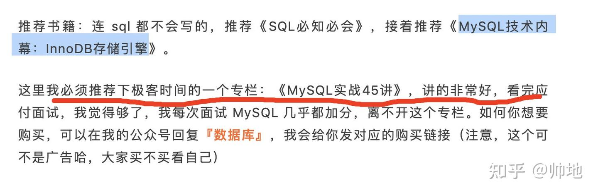

在之前校招面试中，mysql 被问到频率是真的高，当初为了能够在 mysql 这块加分，看了不少书籍，在网上也找了不少资料，庆幸的是，每次面试官问到 mysql 相关知识，我基本都能对答如流，而且还能从一个小的知识点扯出一大堆的那种，所以呢，今天帅地想给大家分享一下我都学习了啥，文中会给出书籍 + 看过的资料。

### 入门

mysql 入门随便找一个教程就可以了，我看的是[《mysql必知必会》](https://zhida.zhihu.com/search?content_id=168895258&content_type=Article&match_order=1&q=《mysql必知必会》&zhida_source=entity)这本书，跟着书敲代码即可，感觉几天时间就可以快速刷完了，反正命令不用死记硬背，需要用的时候，翻开书本会用就行了，后面去刷一刷 sql 的练习题，例如去 [牛客网](https://zhida.zhihu.com/search?content_id=168895258&content_type=Article&match_order=1&q=牛客网&zhida_source=entity)把 sql 相关的几十道练习题安排了，就大致都记住了（链接直达：[https://www.nowcoder.com/activity/oj?tab=1](https://link.zhihu.com/?target=https%3A//www.nowcoder.com/activity/oj%3Ftab%3D1)）。

入门这块没啥好讲的，面试大部分问的都是「原理」相关，而《mysql必知必会》这本书，就真的只是让你来使用 sql 而已，原理讲的比较少。

### 进阶

面试造火箭，工作拧螺丝，虽然工作时我们都在使用基本的 sql，但是不好意思，面试 90% 都在问原理，例如索引，锁，日志，引擎啊，为了让大家在学习的时候有一个重点，我觉得如果掌握了如下知识，mysql 面试绝对会成为你的加分项：

1、一条 sql 语句是如何执行的？也就是说，从客户端执行了一条 sql 命令，服务端会进行哪些处理？（例如验证身份，是否启用缓存啥的）。

2、索引相关：索引是如何实现的？多种引擎的实现区别？聚族索引，非聚族索引，二级索引，唯一索引、最左匹配原则等等（非常重要）。

3、事务相关：例如事务的隔离是如何实现的？事务是如何保证原子性？不同的事务看到的数据怎么就不一样了？难道每个事务都拷贝一份视图？MVCC 的实现原理（重要）等等。

4、各种锁相关：例如表锁，行锁，间隙锁，共享锁，排他锁。这些锁的出现主要是用来解决哪些问题？（重要）

5、日志相关：redolog，binlog，undolog，这些日志的实现原理，为了解决怎么问题？日志也是非常重要的吧，面试也问的挺多。

6、数据库的主从备份、如何保证数据不丢失、如何保证高可用等等。

7、一些故障排查的命令，例如慢查询，sql 的执行计划，索引统计的刷新等等。

对于 2-4 这四个相关知识，面试被问到的频率是最高的，有时候面试会让你说一说索引，如果你知道的多的话就可以疯狂扯一波了，记得我当时总结了一套扯的模版：

先说从 B 树角度说为啥索引会快-》趁机说一下索引的其他实现方式-〉不同引擎在索引实现上的不同-》系统是如果判断是否要使用索引的-〉明明加了索引却不走索引？

只有你对各种数据结构和索引原理都懂，你才能扯的起来，对于事物和锁也是，当时面试官问了我事务是如何保证一致性的，刚好我研究过 ，redolog，binlog，undolog 这些日志，然后和面试官扯了好久。

好吧，说了这么多，其实我就是想说，你一定要对以上的知识知其所以然，不过 mysql 不像算法这些需要学习很多，所以在学习顺序方面，没啥好介绍的，按照书籍的顺序来学习即可。下面我主要给大家推荐一本看过的书以及一份贼棒的专栏，如果你把这两个都学了，在面试时基本对答如流。

（1）、**书籍推荐**

我最开始是买了[《高性能mysql》](https://zhida.zhihu.com/search?content_id=168895258&content_type=Article&match_order=1&q=《高性能mysql》&zhida_source=entity)这本书，感觉这是一本天书，扯到的东西太多了，可能也有挺多人推荐这本书的，但是我看了几章我就没看了，所以你只是想搞定面试的话，我觉得没必要去看这本，我看的是[《MySQL技术内幕：InnoDB存储引擎》](https://zhida.zhihu.com/search?content_id=168895258&content_type=Article&match_order=1&q=《MySQL技术内幕：InnoDB存储引擎》&zhida_source=entity)这本书，不是很厚，但我觉得看起来很舒服，这本书不是很全，感觉给我最大帮助的是关于「锁」那块的知识，其次是索引的一些知识，还是值得一看的书。

如果你认真看，这本书也是几天就能看完了，内容不是很多，但是单单这本书不足以应付面试，下面我必须给大家推荐一个我自认为贼好的专栏。

**（2）、[Mysql 实战 45 讲](https://zhida.zhihu.com/search?content_id=168895258&content_type=Article&match_order=1&q=Mysql+实战+45+讲&zhida_source=entity)**

这是极客时间的一个专栏，其实我在之前秋招结束之后也给大家推荐过

这是[丁奇](https://zhida.zhihu.com/search?content_id=168895258&content_type=Article&match_order=1&q=丁奇&zhida_source=entity)写的一个专栏，其实我在之前秋招结束之后也给大家推荐过。 但凡你对数据库有点了解，就应该听过丁奇的名字。他先后在百度、阿里、腾讯任职，从事 MySQL 相关工作 10 多年了。在阿里跟褚霸共事，参与了阿里云关系型数据库服务内核的开发，负责开源分支 [AliSQL](https://zhida.zhihu.com/search?content_id=168895258&content_type=Article&match_order=1&q=AliSQL&zhida_source=entity)，现任腾讯云数据库负责人，可以说是**数据库领域名副其实的大佬了。**

这种专栏不像书籍系统，这种专栏更加偏向于「面试」和「实战」，可能是校招的原因，分库分表啥的问的少一些，所以我只刷了 74%，但足以应付面试。如果你要学的话，我觉得可以先看这个专栏，之后再去看那本书籍，当然，反过来也可以，我个人是先看的专栏。

我相信应该有不少读者看过这个专栏，有一部分是通过我之前介绍购买的，有一部分是通过其他公众号推荐购买的，但无论你是从哪购买的，如果你想应付面试，把这个专栏 + 《MySQL技术内幕：InnoDB存储引擎》这本书刷了，想不稳都难。

还有一部分需要注意的就是，故障的排查，这些一般需要自己动手去实践，例如如果查看一条 sql 的执行计划，多条 sql 的执行会发生死锁，怎么查看是否发生了死锁呢？

这一部分，一定要跟着书或者专栏动手去做，会让你理解的更加深刻。

Mysql 的内容不算多，学起来还是很快，从 0 到 1，把《mysql必知必会》+《MySQL技术内幕：InnoDB存储引擎》 + Mysql 实战 45 讲，我觉得就差不多了，虽然 mysql 实战 45 讲是付费专栏，这 70 元可能会成为你拿 offer 的关键。

### **作者简洁**

> 作者：大家好，我是帅地，从大学、自学一路走来，深知**算法**，**计算机基础知识**的重要性，目前专注于写这些底层知识，提升我们的内功，帅地期待你的关注，和我一起学习，点击[了解我四年大学学习之路](https://link.zhihu.com/?target=https%3A//mp.weixin.qq.com/s/NvhXxUXmcotGBZ6SPAN3Aw) **转载说明**：未获得授权，禁止转载